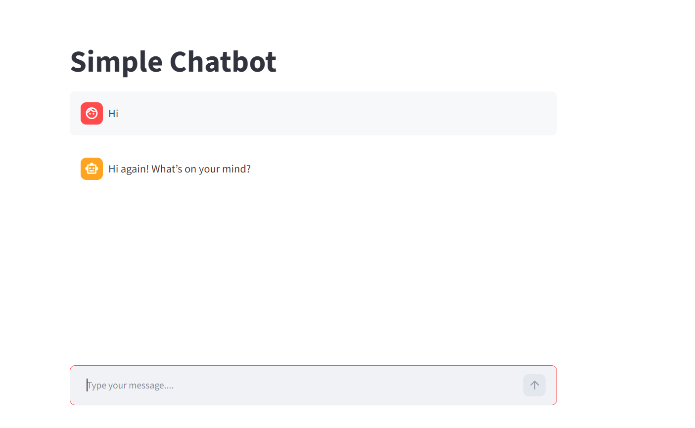

# Simple Chatbot

A small chatbot powered by the OpenAI API. It comes in two flavors:

- **`chatbot.py`** — a command-line chatbot with conversation memory.
- **`app.py`** — a web UI built with [Streamlit](https://streamlit.io/).

## Screenshot



## Setup

1. Clone the repo and install dependencies:

   ```bash
   pip install -r requirements.txt
   ```

2. Create a `.env` file in the project root (see `.env.example`) and add your OpenAI API key:

   ```
   OPENAI_API_KEY=your-api-key-here
   ```

## Usage

**Command line:**

```bash
python chatbot.py
```

Type your messages and use `quit` to exit.

**Web app:**

```bash
streamlit run app.py
```

Then open the URL shown in the terminal (usually http://localhost:8501).

## Tech

- Python
- OpenAI (`gpt-4o-mini`)
- Streamlit
- python-dotenv
