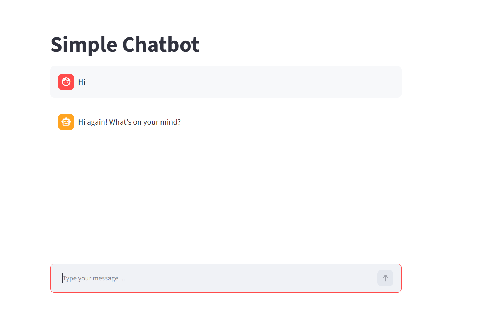

# OpenAI Chatbot

A simple conversational chatbot built with **Python** and the **OpenAI API**, available through both a command-line interface and a Streamlit web application.

The project demonstrates how to integrate an OpenAI language model into a Python application, manage API credentials securely with environment variables, and provide both terminal-based and web-based user interfaces.

## ✨ Features

- 💬 Conversational chatbot powered by the OpenAI API
- 🧠 Conversation memory in the command-line version
- 🖥️ Interactive Streamlit web interface
- 🔐 Secure API-key management using environment variables
- 🐍 Simple Python implementation
- ⚡ Lightweight and easy to run locally

## 🛠️ Tech Stack

- **Python**
- **OpenAI API**
- **GPT-4o-mini**
- **Streamlit**
- **python-dotenv**

## 📁 Project Structure

```text
OpenAI-chatbot/
│
├── app.py              # Streamlit web application
├── chatbot.py          # Command-line chatbot
├── requirements.txt    # Python dependencies
├── .env.example        # Environment variable template
├── Screenshot.png      # Application screenshot
└── README.md           # Project documentation
```

## 🚀 Getting Started

### 1. Clone the repository

```bash
git clone https://github.com/mostaphakayyar/OpenAI-chatbot.git
```

Navigate into the project:

```bash
cd OpenAI-chatbot
```

### 2. Create a virtual environment

```bash
python -m venv .venv
```

Activate it on Windows PowerShell:

```powershell
.venv\Scripts\Activate.ps1
```

### 3. Install dependencies

```bash
pip install -r requirements.txt
```

### 4. Configure your API key

Create a `.env` file in the project root.

You can use `.env.example` as a template.

Add your OpenAI API key:

```env
OPENAI_API_KEY=your-api-key-here
```

**Never commit your `.env` file or expose your API key publicly.**

## ▶️ Usage

### Command-Line Chatbot

Run:

```bash
python chatbot.py
```

Type your messages to interact with the chatbot.

To exit the conversation:

```text
quit
```

### Streamlit Web Application

Run:

```bash
streamlit run app.py
```

Streamlit will provide a local URL, usually:

```text
http://localhost:8501
```

Open the URL in your browser to use the web interface.

## 🖥️ Application



## 🔐 Environment Variables

The application expects the following environment variable:

| Variable | Description |
|---|---|
| `OPENAI_API_KEY` | Your OpenAI API key |

Create a `.env` file locally and never upload it to GitHub.

Example:

```env
OPENAI_API_KEY=your-api-key-here
```

## 📦 Dependencies

The project uses:

```text
openai
python-dotenv
streamlit
```

Install them with:

```bash
pip install -r requirements.txt
```

## 🧪 Testing the Project from a Fresh Clone

To verify that the project can be used by another developer:

```bash
git clone https://github.com/mostaphakayyar/OpenAI-chatbot.git
cd OpenAI-chatbot
python -m venv .venv
.venv\Scripts\Activate.ps1
pip install -r requirements.txt
```

Then configure the `.env` file and run:

```bash
streamlit run app.py
```

## ⚠️ Troubleshooting

### Missing API key

If you see an error such as:

```text
OpenAIError: Missing credentials
```

make sure that:

1. A `.env` file exists in the project root.
2. It contains `OPENAI_API_KEY`.
3. The API key is valid.
4. The application is loading the environment variables correctly.

### API quota or credits

If the application returns a `429` error indicating that your API account has no remaining credits, check your OpenAI API billing and usage settings.

## 🔮 Future Improvements

Possible future improvements include:

- Conversation history in the web interface
- Clear conversation button
- Improved error handling
- Streaming responses
- Custom system prompts
- Model selection
- Persistent conversation storage
- Automated tests

## 📌 Project Purpose

This project is part of my practical learning journey in **AI Engineering**, focusing on building applications that integrate large language models into real Python software.

It provides a foundation for progressing toward more advanced AI applications such as **RAG systems, AI APIs, evaluation pipelines, and production-oriented AI applications**.

## 👤 Author

**Mostapha Kayyar**

GitHub:  
https://github.com/mostaphakayyar

---

⭐ If you find this project useful, feel free to explore the repository and build on it.
## Screenshot


- Streamlit
- python-dotenv
